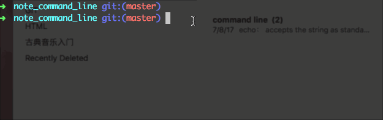

# Some Baisc Command Lines (note)

some notes when I am taking [Codecademy Learn the Command Line](https://www.codecademy.com/learn/learn-the-command-line) course.

1. Directory（与路径有关的操作）: 
    - `pwd` : Print Working Directory（显示当前路径）
    - `cd` : Change Direcotry（打开当前文件夹)
    - `ls`: LiSt (当前路径下的文件列表)
        * `ls -a` : lists all contents, including hidden files and directories (files started with a dot are hidden)
        * `ls -l` : lists all contents of a directory in long format
        * `ls -t` : order files and directories by the time they were last modified
        * `ls -alt` : equal to do `ls -a -l -t` together
    - `mkdir` : MaKe DIRectory (新建文件夹)
        * `mkdir folder_name` : create a new folder_name folder under current directory 在当前路径下新建文件夹
        
    - `touch` : 新建文件
        * `touch new_file.js` : create a new file under current directory 在当前路径下新建文件
    - `cp` : CoPy files/direcotries
        * `cp a b` : copy the content of a into b
        * `cp a b c` : copy the contents of a b into c
        * `cp * b` : copy all in current directory into b
        * `cp m*.txt b` : copy all file start with m into b
    - `mv` : MoVe (移动)
        * `mv a b` : move a to b 将a移入b
        * `mv a.txt b.txt` : rename a.txt to b.txt 将a文件重新命名为b文件
    - `rm` : RoMove (删除文件)
        * `rm` deletes files and directories permanently!!! rm是永久性删除，注意！！！
        * `rm -r folder_name` : deleted folder_name directory and all its child direcotries 删除文件夹已经其所有子文件 (r stands for 'recursive')
        * `rm file_name` : deleted file_name file 删除文件

    